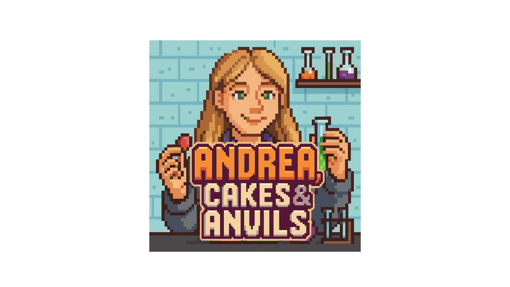
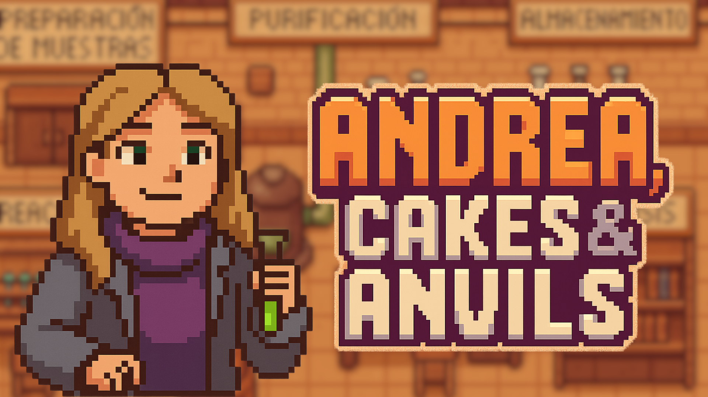

# 🎂 Andrea, Tartas y Yunques ⚗️💎

¡Bienvenida al laboratorio minecraftiano de Andrea!  
Este juego es un regalo de cumpleaños 🎁 para **Andrea**, la química más genial del planeta 🌍. Prepárate para esquivar yunques, atrapar pasteles 🎂, recolectar esmeraldas 💚 y diamantes 💎...

<div align="center">
  
</div>

---

## 🧪 ¿De qué va el juego?

Eres **Andrea**, una brillante química que tiene como objetivo conseguir gemas que caen del cielo sin parar. 
Sin embargo, los yunques no te lo haran tán sencillo.

- 🍰 **Pasteles**: ¡activa poderes mágicos!
  - ❤️ +1 vida (si tienes menos de 3)
  - ⚡ +Velocidad durante 5 segundos
  - 😇 Inmortalidad durante 3 segundos (con halo angelical)

- 💚 **Esmeraldas**: +1 punto  
- 💎 **Diamantes**: +10 puntos  
- 🪓 **Yunques**: si te dan y no eres inmortal, pierdes una vida  

Tienes **3 vidas**. Si las pierdes todas, el juego termina 😢.

<div align="center">
  
</div>

---

## 🕹️ Controles

- ⬅️ ➡️ ⬆️ ⬇️ — Mover a Andrea  
- **Espacio (x2)** — ¡MEGASALTO en la dirección que estás mirando! 🦘  
- ❌ — Cierra el juego (si quieres rendirte 😅)

---

## ✨ Mecánicas especiales

- Cada 2 segundos el juego se **acelera un poco**.  
- A partir de 50 puntos, caen más objetos.  
- A partir de 200 puntos, ¡el caos es total!  
- Si coges una tarta 🍰, prepárate para **una sorpresa al azar**...

---

## 📦 Cómo jugar (si te lo descargas)

1. Instala [Python 3](https://www.python.org/downloads/) y clona el repositorio

2. Instala dependencias:
   ```bash
   pip install pygame

3.	Ejecuta el juego desde el terminal:
python -m src.main

⸻--

🎉 ¡Feliz cumpleaños, Andrea! 🎉

Este juego es tuyo. Puedes jugarlo, romperlo o reírte de él. Lo importante es que te recuerde lo especial que eres para nosotras. Es un placer ser tu amigo.
- Ruben Vasile Marcu Ungureanu, 2025
- 
